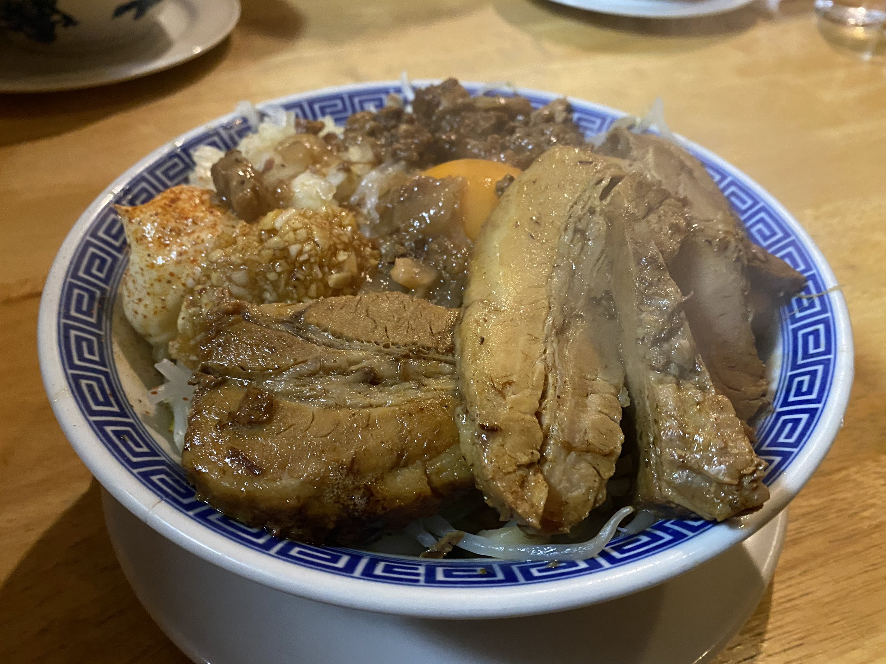

---

title: "ラーメン同好会"
date: 2022-08-04T20:14:45+09:00
categories: ["", ""]
description: ""
tags: ["ramen"]
author: "Uyu"
weight: 
---

ラーメンを食す活動をしています。

<!--more-->

<!--
figure shortcodeをいじったら壊れたので、治るまでraw HTMLで書きます
-->

<h3>栃木県本部</h3>

- #### 元町家

<figure>
  
  <figcaption>
      <h5>聖地</h5>
  </figcaption>
</figure>

<figure>
  
  <figcaption>
      <h5>並キャベツ九条ネギ</h5>
  </figcaption>
</figure>

- #### 板橋家
- #### どる屋
- #### ひばり
- #### ガジロー

<figure>
  
  <figcaption>
      <h5>まぜそば中小豚</h5>
  </figcaption>
</figure>

- #### ハイマウント



<h3>県外支部</h3>

- #### 青葉(大宮)

- #### 麺屋こころ



- #### 豚山(元住吉)



- #### 豚星



- #### どん



- #### 福仙楼(北白川)



- #### 池田屋(一乗寺)


